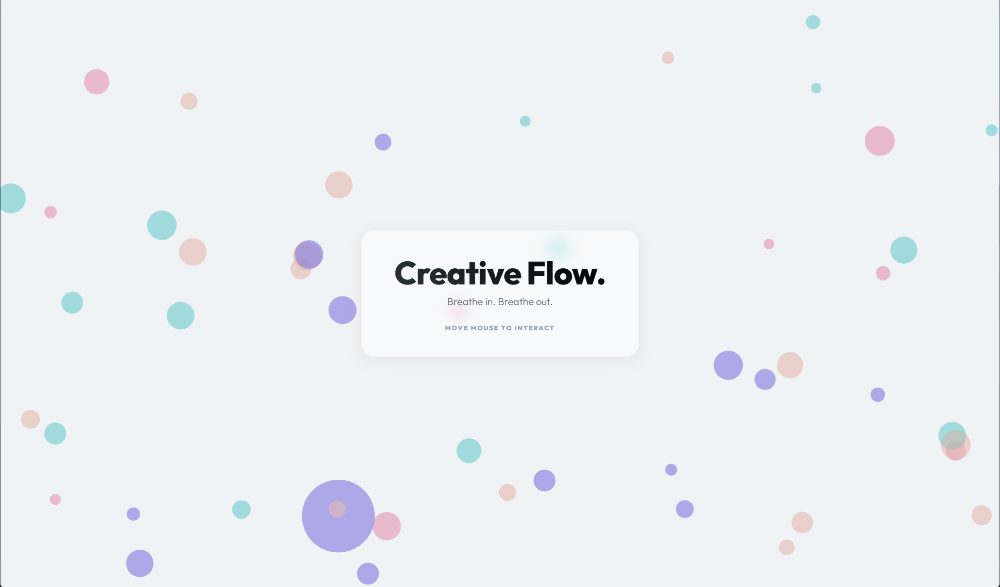

# Calm Digital Space (leiqos.github.io)



A serene, interactive landing page built with HTML5 Canvas, CSS, and Vanilla JavaScript. 

## ✨ Features
- **Interactive Canvas Environment**: Floating, colorful orbs react to mouse movements.
- **Click Effects**: Clicking the canvas generates gentle ripples of new particles.
- **Modern aesthetics**: A clean glassmorphism panel overlay with smooth entry animations and harmonious HSLA colors (`multiply` blend mode).
- **Fully Responsive**: Adapts automatically to window resizing to ensure a seamless experience on any device.
- **Lightweight**: Zero external dependencies—just fast, native web technologies.

## 🛠️ Technologies Used
- **HTML5 Canvas API** for rendering the particle system.
- **CSS3** (Custom Properties, Flexbox, Glassmorphism, Animations).
- **Vanilla JavaScript** (ES6+ Classes, `requestAnimationFrame` for smooth 60fps rendering).

## 🚀 How to Run Locally
Because this project utilizes standard web technologies with no build steps, you can run it instantly:

1. Clone this repository to your local machine:
   ```bash
   git clone https://github.com/leiqos/leiqos.github.io.git
   ```
2. Navigate into the project folder.
3. Open `index.html` in your favorite web browser.
4. Move your mouse or click to interact with the particles!